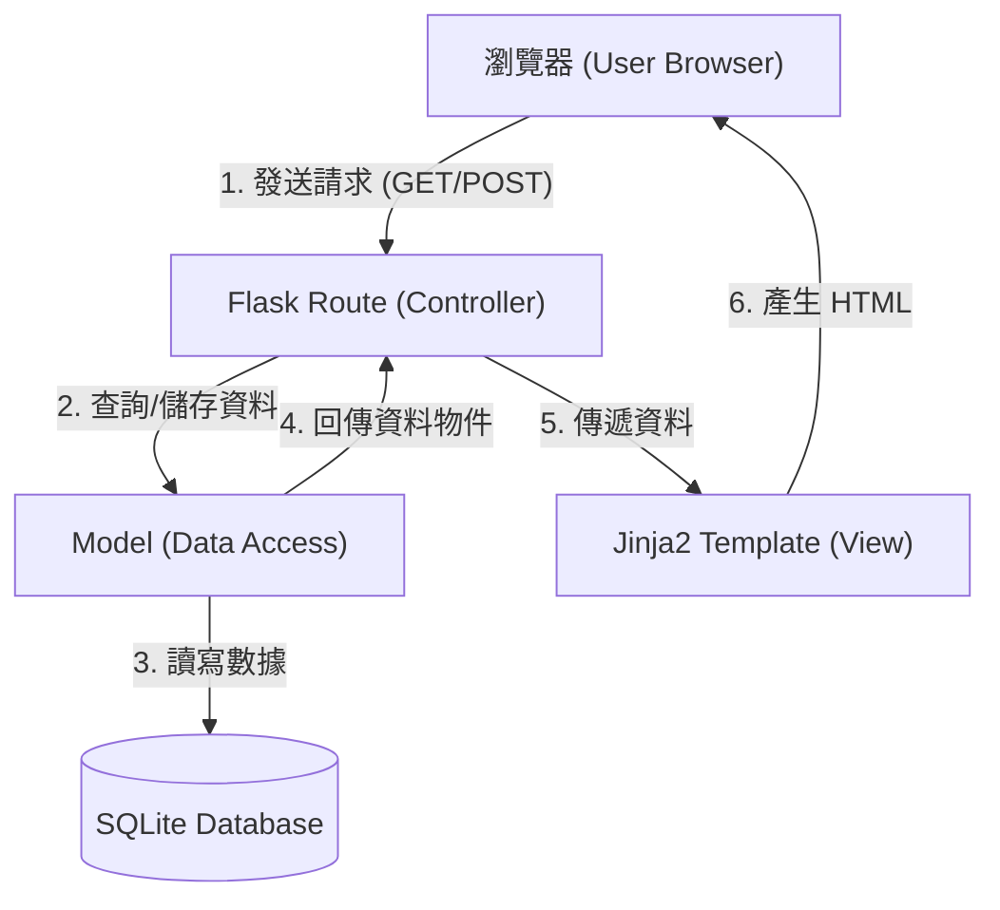

# 任務管理系統 (Task Management System) 系統架構文件

## 1. 技術架構說明

本專案採用經典的 **MVC (Model-View-Controller)** 模式進行開發，確保程式碼結構清晰且易於維護。

### 選用技術與原因
- **語言**: Python (易於編寫與閱讀)
- **後端框架**: Flask (輕量級架構，適合中小型專案與快速開發)
- **模板引擎**: Jinja2 (內建於 Flask，可動態生成 HTML 頁面)
- **資料庫**: SQLite (檔案式資料庫，無需額外安裝伺服器，方便部署)
- **前端工具**: Vanilla CSS & JavaScript (保持純粹的 Web 技術，提升效能)

### MVC 模式說明
- **Model (模型)**: 負責資料邏輯，處理 SQLite 資料庫的存取與任務數據結構。
- **View (視圖)**: 使用 Jinja2 模板渲染 HTML 頁面，將資料呈現給用戶。
- **Controller (控制器)**: 即 Flask 的路由 (Routes)，負責處理用戶請求、呼叫 Model 處理資料，並決定回傳哪個 View。

---

## 2. 專案資料夾結構

```text
/
├── app/                  # 應用程式主程式碼
│   ├── models/           # 資料庫模型 (任務資料結構與資料庫操作)
│   │   └── task.py       # 定義 Task 類別與數據處理
│   ├── routes/           # 路由邏輯 (處理請求與網頁導向)
│   │   └── task_routes.py # 處理新增、刪除、完成標記等路由
│   ├── templates/        # Jinja2 HTML 模板
│   │   ├── base.html     # 共用佈局 (Layout)
│   │   └── index.html    # 首頁 (任務列表)
│   └── static/           # 靜態資源
│       ├── css/          # Vanilla CSS 樣式表
│       │   └── style.css # 系統樣式設計
│       └── js/           # 前端互動邏輯
│           └── main.js   # 處理前端刪除確認或篩選切換
├── docs/                 # 文件夾 (PRD, ARCHITECTURE 等)
├── instance/             # 存放實例特定檔案 (如資料庫)
│   └── database.db       # SQLite 資料庫檔案
├── app.py                # 應用程式入口點 (初始化 Flask)
├── requirements.txt      # 專案套件依賴清單
└── README.md             # 專案說明文件
```

---

## 3. 元件關係圖



---

## 4. 關鍵設計決策

1. **採用伺服器端渲染 (SSR)**: 使用 Jinja2 而非 React/Vue。原因在於本專案目標單一，使用 SSR 可以減少前端開發成本，加快首次頁面載入速度。
2. **單一資料庫檔案 (SQLite)**: 選擇 SQLite 能讓團隊成員無需配置資料庫伺服器即可運行專案，且符合個人用戶管理任務的輕量需求。
3. **區分 Routes 與 Models**: 將業務邏輯 (Route) 與資料存取 (Model) 分開。這樣未來如果要將資料庫換成 MySQL 或 PostgreSQL，只需修改 `models/` 內的程式碼即可，不影響路由邏輯。
4. **使用 Instance 資料夾**: 將資料庫檔案放在 `instance/` 資料夾中是 Flask 的推薦做法，有助於區分程式碼與資料，並在部署時便於設定 `.gitignore` 排除具體資料檔案。
5. **模組化路由 (Blueprints)**: 雖然目前功能較少，但仍建議使用 Blueprint 結構，以便未來功能擴充（例如加入使用者登入系統）時更具彈性。
