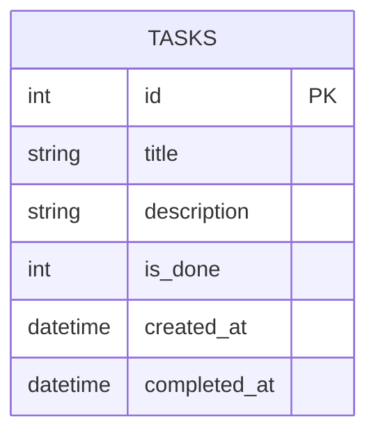

# 資料庫設計文件（DB Design）

**專案名稱：** 任務管理系統  
**文件版本：** v1.0  
**建立日期：** 2026-04-15  
**參考文件：** PRD.md、FLOWCHART.md  
**資料庫：** SQLite

---

## 1. ER 圖（實體關係圖）

本系統初版為單一資料表設計，僅包含 `tasks` 表。



> 💡 初版為個人單用戶系統，不需要 `users` 資料表。若未來擴充多用戶功能，可新增 `users` 表並以 `user_id` 外鍵關聯。

---

## 2. 資料表詳細說明

### 資料表：`tasks`

儲存所有使用者建立的任務。

| 欄位名稱 | 資料型別 | 必填 | 預設值 | 說明 |
|----------|----------|------|--------|------|
| `id` | INTEGER | ✅ | 自動遞增 | 主鍵（Primary Key） |
| `title` | TEXT | ✅ | — | 任務名稱，最長 200 字元 |
| `description` | TEXT | ❌ | NULL | 任務描述 / 備註（選填） |
| `is_done` | INTEGER | ✅ | 0 | 完成狀態：0 = 待辦中，1 = 已完成 |
| `created_at` | TEXT | ✅ | 當下時間 | 任務建立時間（ISO 8601 格式） |
| `completed_at` | TEXT | ❌ | NULL | 任務標記完成的時間（ISO 8601 格式） |

**欄位補充說明：**

- `id`：`INTEGER PRIMARY KEY AUTOINCREMENT`，SQLite 自動管理
- `title`：使用者輸入的任務名稱，存入前需去除首尾空白
- `is_done`：使用整數模擬布林值（SQLite 無原生 BOOLEAN）
- `created_at`：建立時自動填入，格式為 `2026-04-15T21:00:00`
- `completed_at`：任務標記完成時填入；若狀態改回未完成，設為 `NULL`

---

## 3. SQL 建表語法

詳細語法請見 [`database/schema.sql`](../database/schema.sql)。

```sql
-- 任務管理系統 - SQLite 資料庫建表語法
-- 版本：v1.0 / 建立日期：2026-04-15

CREATE TABLE IF NOT EXISTS tasks (
    id           INTEGER PRIMARY KEY AUTOINCREMENT,
    title        TEXT    NOT NULL,
    description  TEXT,
    is_done      INTEGER NOT NULL DEFAULT 0,
    created_at   TEXT    NOT NULL DEFAULT (datetime('now', 'localtime')),
    completed_at TEXT
);
```

---

## 4. 資料範例

```sql
INSERT INTO tasks (title, description, is_done, created_at)
VALUES
  ('完成期末報告', '需要在下週五前繳交', 0, '2026-04-15T09:00:00'),
  ('預約牙醫', NULL, 0, '2026-04-15T10:30:00'),
  ('買牛奶', NULL, 1, '2026-04-15T11:00:00');
```

---

## 5. 索引規劃

| 索引名稱 | 目標欄位 | 說明 |
|----------|----------|------|
| `idx_tasks_is_done` | `is_done` | 加速依狀態篩選的查詢效能 |

```sql
CREATE INDEX IF NOT EXISTS idx_tasks_is_done ON tasks (is_done);
```

---

## 6. 設計決策說明

| 決策 | 選擇 | 原因 |
|------|------|------|
| 時間格式 | TEXT（ISO 8601） | SQLite 無原生 DATETIME，TEXT 最相容 |
| 布林欄位 | INTEGER（0/1） | SQLite 無原生 BOOLEAN 型別 |
| 刪除策略 | 硬刪除（`DELETE`） | 初版不需保留已刪除記錄 |
| ORM 工具 | 原生 `sqlite3` | 輕量需求，不引入 SQLAlchemy 依賴 |
