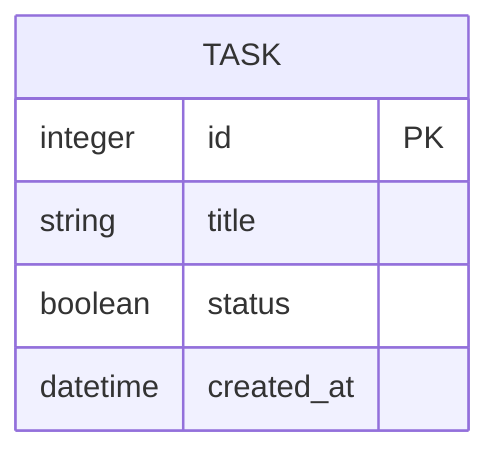

# 資料庫設計文件 (Database Design)

## 1. ER 圖（實體關係圖）



## 2. 資料表詳細說明

### `tasks` 資料表
儲存用戶建立的所有任務。

| 欄位名稱 | 型別 | 必填 | 說明 |
| :--- | :--- | :--- | :--- |
| `id` | INTEGER | 是 | Primary Key, 自動遞增的唯一識別碼 |
| `title` | TEXT | 是 | 任務標題/內容 |
| `status` | BOOLEAN | 是 | 任務狀態 (0: 未完成, 1: 已完成) |
| `created_at` | DATETIME | 是 | 任務建立時間，預設為當下時間 |

## 3. SQL 建表語法

完整的建表語法儲存於 `database/schema.sql`。

```sql
CREATE TABLE IF NOT EXISTS tasks (
    id INTEGER PRIMARY KEY AUTOINCREMENT,
    title TEXT NOT NULL,
    status BOOLEAN NOT NULL DEFAULT 0,
    created_at DATETIME DEFAULT CURRENT_TIMESTAMP
);
```

## 4. Python Model 程式碼
Model 實作位於 `app/models/task.py`，使用內建 `sqlite3` 模組負責與資料庫的互動，支援基礎的 CRUD 功能：
- `create`: 新增任務
- `get_all`: 取得所有任務 (支援狀態篩選)
- `get_by_id`: 取得單一任務
- `update_status`: 切換任務完成狀態
- `delete`: 刪除任務
