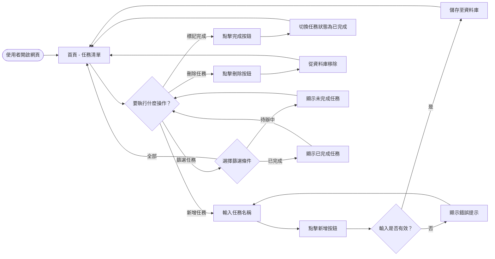
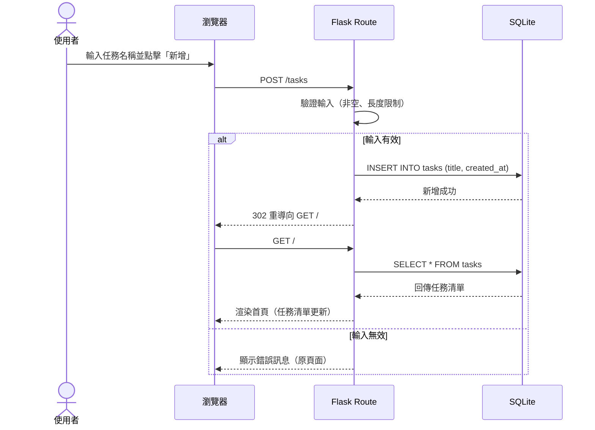
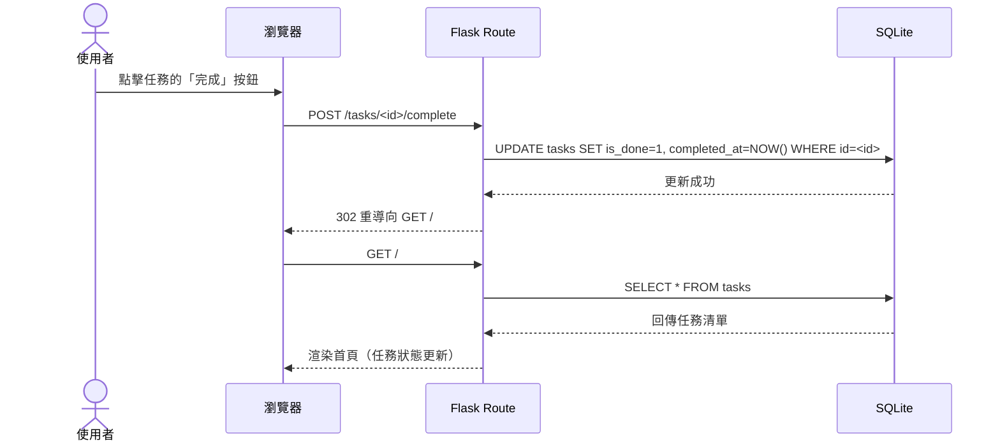
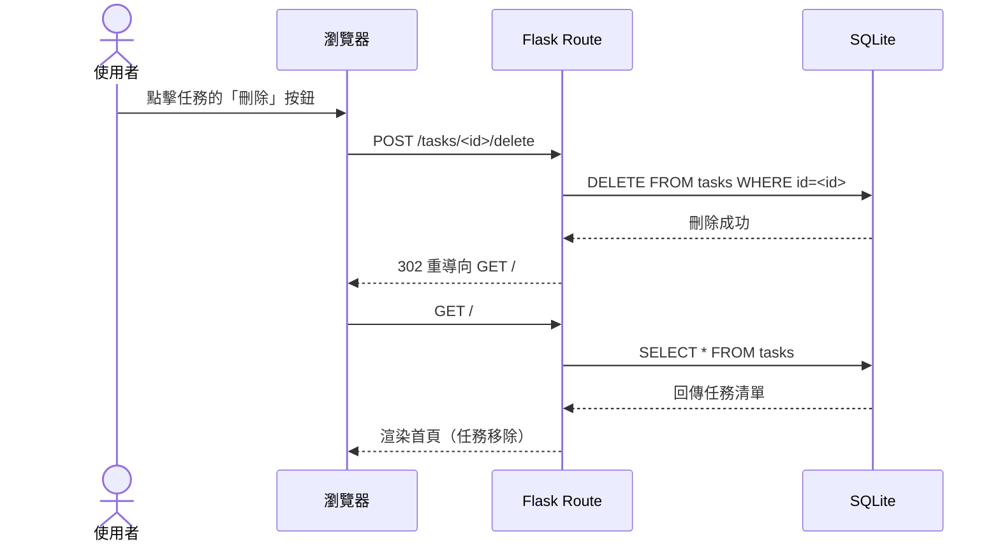
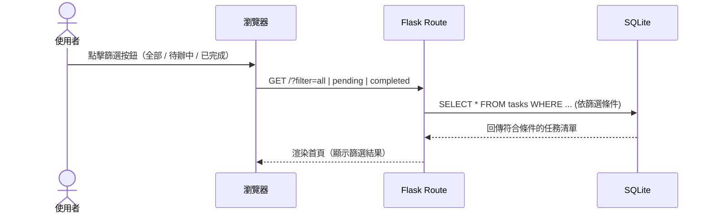

# 流程圖文件（FLOWCHART）

**專案名稱：** 任務管理系統  
**文件版本：** v1.0  
**建立日期：** 2026-04-15  
**參考文件：** PRD.md

---

## 1. 使用者流程圖（User Flow）

描述使用者從進入網站到完成各項操作的完整路徑。

---

## 2. 系統序列圖（System Sequence Diagram）

描述各主要功能中，使用者、瀏覽器、Flask 後端與 SQLite 資料庫之間的互動流程。

### 2.1 新增任務

### 2.2 標記任務完成

### 2.3 刪除任務

### 2.4 篩選任務

---

## 3. 功能清單對照表

| 功能編號 | 功能名稱 | URL 路徑 | HTTP 方法 | 說明 |
|----------|----------|----------|-----------|------|
| F-01 | 顯示任務清單 | `/` | GET | 首頁，顯示所有任務 |
| F-02 | 依狀態篩選 | `/?filter=<all\|pending\|completed>` | GET | Query String 控制篩選條件 |
| F-03 | 新增任務 | `/tasks` | POST | 接收表單資料，建立新任務 |
| F-04 | 標記任務完成 | `/tasks/<id>/complete` | POST | 切換指定任務的完成狀態 |
| F-05 | 刪除任務 | `/tasks/<id>/delete` | POST | 刪除指定任務 |

> 💡 **設計說明：** 由於使用 HTML form，刪除與狀態切換統一使用 POST 方法，避免瀏覽器直接呼叫 GET 造成誤操作。

---

## 4. 頁面狀態說明

| 頁面狀態 | 觸發條件 | 顯示內容 |
|----------|----------|----------|
| 預設（全部） | `GET /` 或 `GET /?filter=all` | 所有任務清單 |
| 待辦中篩選 | `GET /?filter=pending` | `is_done = 0` 的任務 |
| 已完成篩選 | `GET /?filter=completed` | `is_done = 1` 的任務 |
| 新增成功 | POST /tasks 成功後 | 重導向首頁，任務清單更新 |
| 輸入錯誤 | POST /tasks 驗證失敗 | 首頁顯示錯誤提示訊息 |
