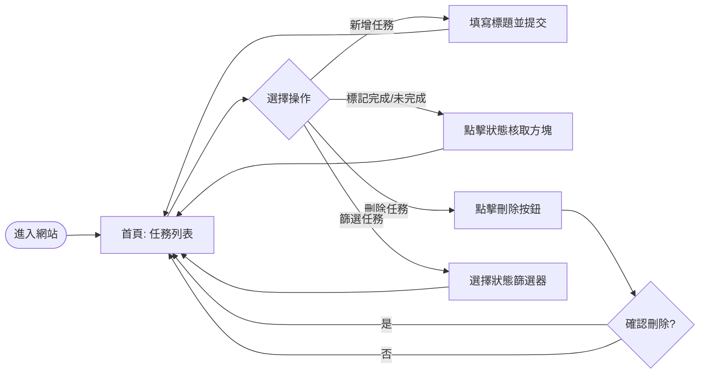
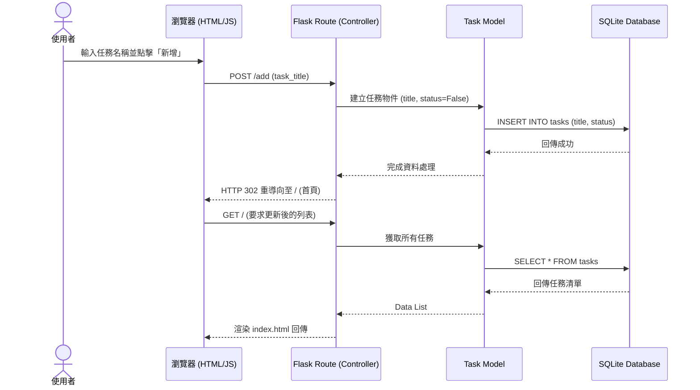
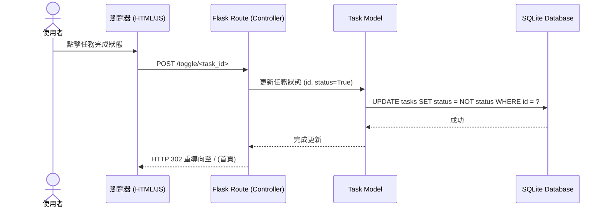

# 任務管理系統 (Task Management System) 流程圖文件

本文件包含使用者操作流程、系統資料流向，以及功能路由對照表。

---

## 1. 使用者流程圖 (User Flow)

描述使用者進入系統後的操作選擇與路徑。

---

## 2. 系統序列圖 (Sequence Diagram)

以「新增任務」與「標記完成」為例，描述資料如何在各元件間流動。

### 場景：新增任務

### 場景：標記任務完成

---

## 3. 功能清單與路由對照表

本表格列出系統主要功能及其對應的後端進入點。

| 功能名稱 | URL 路徑 | HTTP 方法 | 說明 |
| :--- | :--- | :--- | :--- |
| 顯示任務清單 | `/` | `GET` | 渲染首頁，顯示所有或篩選過的任務 |
| 新增任務 | `/add` | `POST` | 接收表單標題並存入資料庫 |
| 標記任務狀態 | `/toggle/<int:id>` | `POST/GET` | 切換任務的完成/未完成狀態 |
| 刪除任務 | `/delete/<int:id>` | `POST` | 將指定 ID 的任務從資料庫移除 |
| 篩選任務 | `/?filter=done` | `GET` | 透過 query string 進行狀態篩選 |

---

## 4. 流程設計說明

1. **同步作業流程**: 由於採用 Flask + Jinja2 的架構，大部分操作 (新增、刪除、狀態切換) 都會觸發頁面刷新 (Redirect)，這確保了資料狀態與 UI 的高度一致性。
2. **防呆機制**: 在「新增任務」流程中，必須檢核標題是否為空；在「刪除任務」流程中，建議加入 JavaScript 確認視窗，防止誤刪。
3. **URL 設計**: 遵循 RESTful 風格建議，使用動態 URL 參數 (`<id>`) 來識別特定任務資源。
